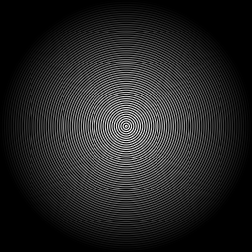

# AutoNormalPerlage

A streamlined tool for creating cone-shaped normal maps used in game development and 3D graphics.

## What It Does

AutoNormalPerlage generates high-quality normal maps for simulating detailed surface textures without adding geometry:

- Creates circular/cone patterns used for watchmaking textures like perlage
- Generates both height maps and normal maps
- Includes matcap previews to visualize the 3D effect
- Perfect for game assets, 3D models, and digital art

## Features

- **Simple Controls**: Adjust size, height, strength, and radius with intuitive sliders
- **Real-time Preview**: See changes instantly with matcap visualization
- **Pattern Options**: Create single cones or arranged patterns
- **Customizable**: Control segments, rotation, and other parameters
- **Export Options**: Save high-resolution PNG outputs

## Output Types

The application generates three different visualization types:

### Height Map


A grayscale representation where brightness indicates height. The brightest areas (white) represent the highest points of the surface, while darker areas represent lower points. This is the raw height data before normal conversion.

### Normal Map


RGB-encoded surface normals where each color channel (red, green, blue) represents the X, Y, and Z components of the surface normal vector. This format is used by game engines and 3D software to simulate detailed surfaces without additional geometry.

### Matcap Preview


A visualization of how the normal map would appear when rendered with materials and lighting. This preview uses environment mapping (material capture or "matcap") to simulate realistic lighting and reflections on the surface.

## Quick Start

1. Run `python cone_normal_map_generator.py`
2. Adjust parameters using the sliders
3. Use the "Generate" button to create your normal map
4. Preview how it will look in 3D with the matcap viewer
5. Save the result using the "Save" button

## Use in Game Engines

The generated normal maps can be directly imported into:
- Unity
- Unreal Engine
- Godot
- Blender
- Other 3D software supporting normal maps

## Requirements

- Python 3.x
- NumPy, Pillow (PIL), SciPy, and Tkinter

## Installation

```bash
# Install required packages
pip install numpy pillow scipy
```

Clone this repository and run the application:

```bash
python cone_normal_map_generator.py
```
